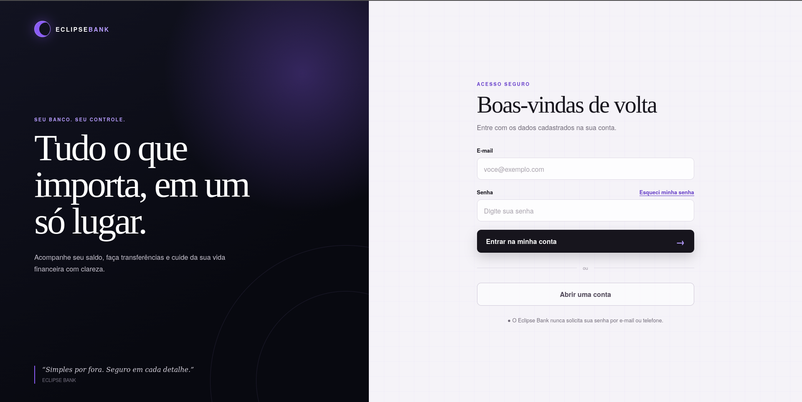
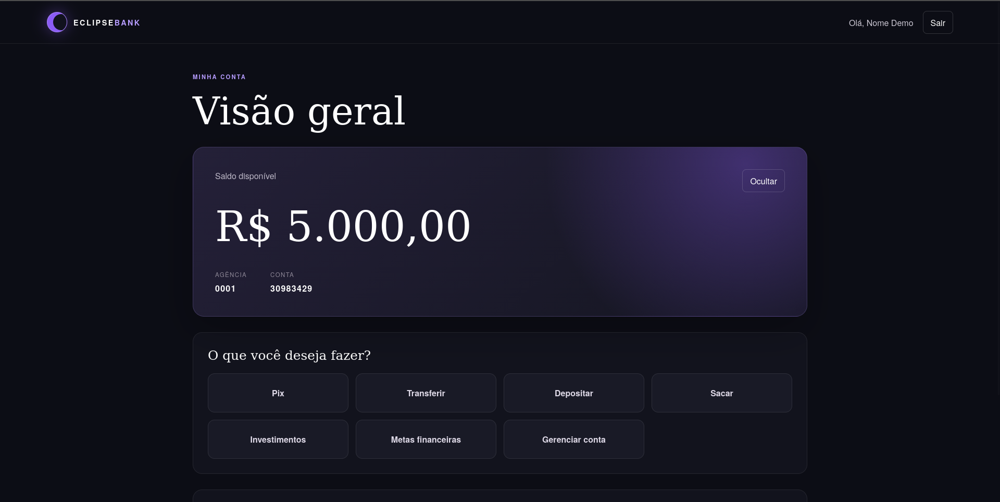
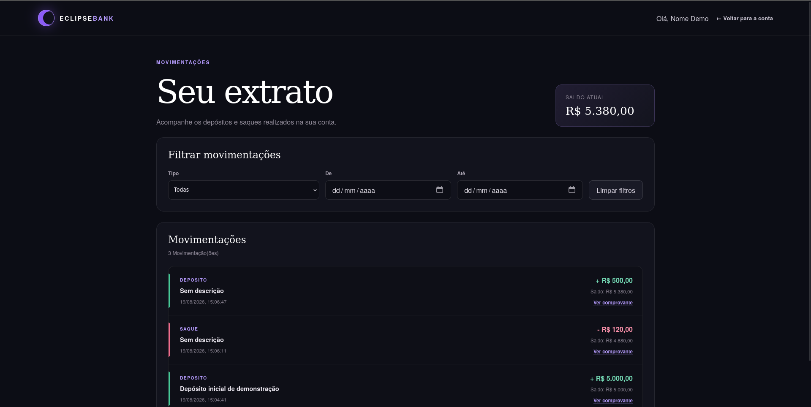
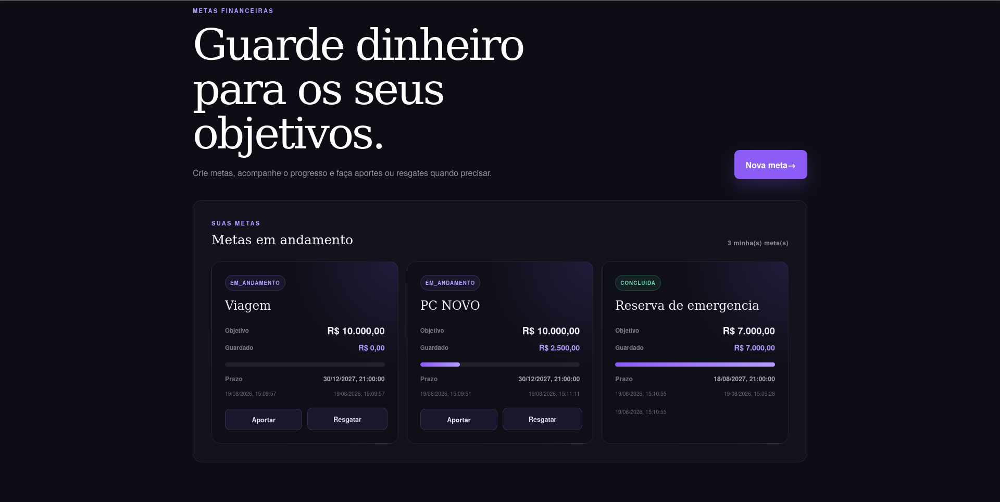
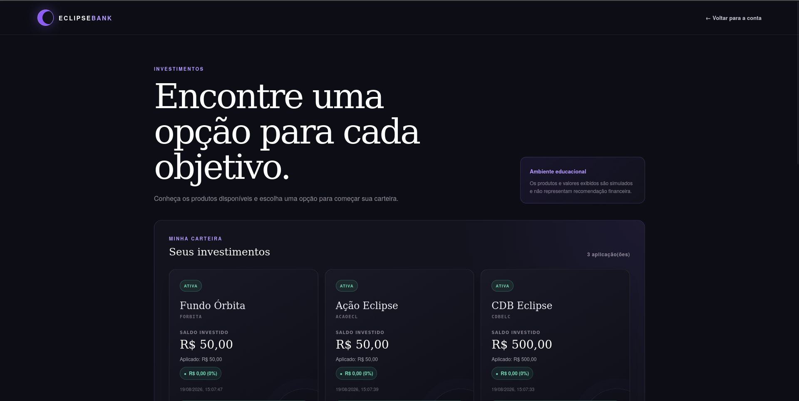
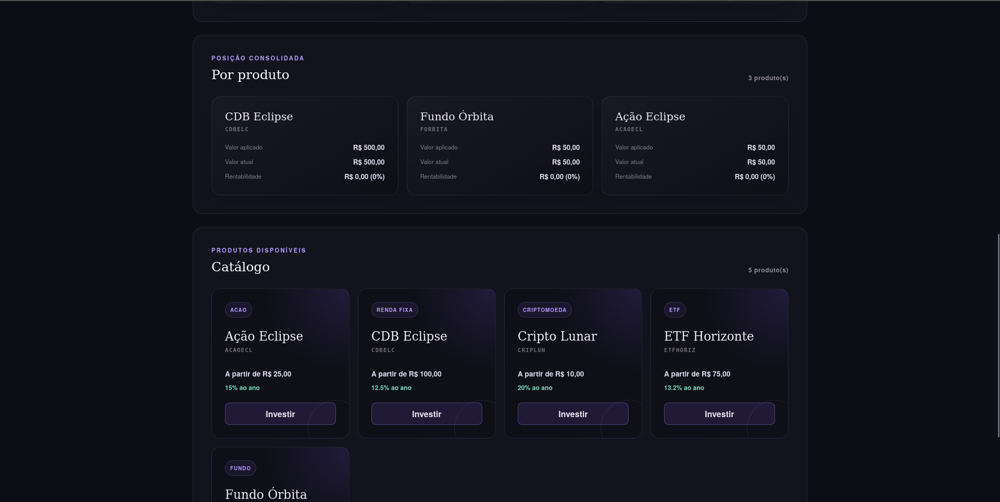
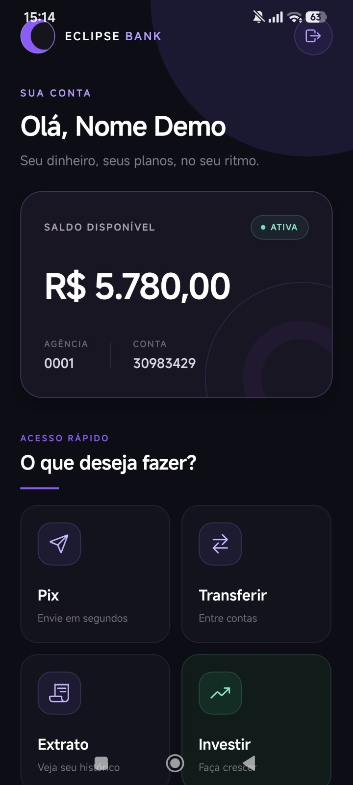
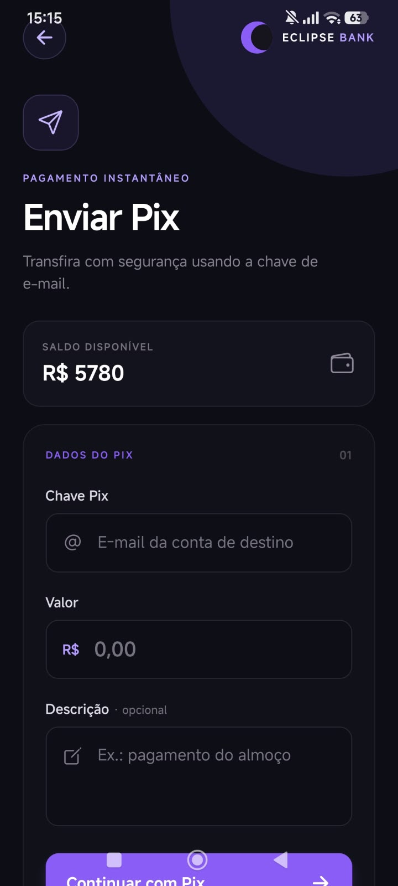
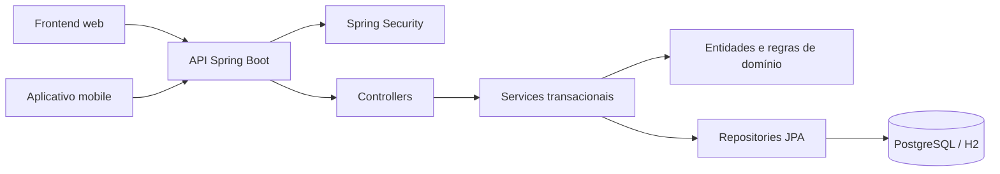

# Eclipse Bank V2

Banco digital fictício desenvolvido como projeto principal de portfólio. O sistema reúne backend Spring Boot, frontend web próprio e aplicativo mobile em React Native para simular uma experiência bancária completa, com foco em segurança, arquitetura em camadas, testes e regras de negócio consistentes.

> Projeto educacional: o Eclipse Bank não movimenta dinheiro real e não oferece recomendações financeiras.

Esta é uma reconstrução completa do projeto original [ECLIPSE-BANK](https://github.com/Isabella-Roder/ECLIPSE-BANK), aplicando um padrão de código mais organizado, seguro e próximo de uma aplicação profissional.

## Destaques

- Autenticação com Spring Security e sessão opaca no servidor.
- Cookie de sessão `HttpOnly`, proteção CSRF e autorização por proprietário do recurso.
- Conta corrente com depósito, saque, Pix, transferência, extrato e comprovantes.
- Bloqueio, desbloqueio e encerramento de conta com validações de domínio.
- Carteira de investimentos simulados com aplicação, resgate, posição consolidada e rentabilidade.
- Fundos imobiliários com cotas e pagamento simulado de proventos.
- Metas financeiras com criação, aporte, resgate e acompanhamento de progresso.
- Empréstimos simulados com cálculo de juros, geração de parcelas, aprovação e pagamento.
- Frontend web responsivo servido pelo próprio Spring Boot em produção.
- Aplicativo React Native integrado à mesma API segura.
- PostgreSQL e aplicação executados com Docker Compose.
- Documentação OpenAPI/Swagger e suíte automatizada de testes.

## Demonstração pública

A aplicação completa está publicada em: **https://eclipse-bank-v2.onrender.com/**

> Hospedado no plano gratuito do Render: a primeira requisição após um período de inatividade pode levar alguns segundos para responder.

## Acesso de demonstração

Use a conta fictícia abaixo para conhecer as funcionalidades do Eclipse Bank:

| Campo | Dado de demonstração |
| --- | --- |
| E-mail | `demo@eclipsebank.com` |
| Senha | `SenhaDemo123` |
| Saldo inicial | R$ 5.000,00 |

> Essas credenciais são exclusivas do ambiente de demonstração e não correspondem a dados pessoais reais.

## Demonstração visual

### Aplicação web

<p align="center">
  
  
</p>
<p align="center">
  
  
</p>
<p align="center">
  
  
</p>

### Aplicativo mobile

<p align="center">
  
  
  
</p>

## Funcionalidades

### Conta digital

- Cadastro de pessoa física e login.
- E-mail e CPF únicos.
- Criação de conta com agência e número exclusivos.
- Consulta de saldo e movimentações recentes.
- Depósito e saque.
- Transferência entre contas.
- Pix por chave de e-mail.
- Extrato com filtros por tipo e período.
- Comprovante com código UUID.
- Bloqueio, desbloqueio e encerramento da conta.

### Investimentos simulados

- Catálogo de renda fixa, fundos, ações, ETFs e criptomoedas.
- Aplicação e resgate parcial ou total.
- Posição consolidada por produto.
- Quantidade, preço médio, valor atual e rentabilidade.
- Atualização simulada de rendimentos por taxa e período.
- Fundos imobiliários com quantidade de cotas.
- Pagamento mensal simulado de proventos, protegido contra duplicidade.

### Metas financeiras

- Criação de metas com valor-alvo e prazo.
- Aportes usando o saldo da conta.
- Resgates para a conta corrente.
- Conclusão automática ao atingir o objetivo.
- Barra de progresso no frontend web.

### Empréstimos simulados

- Simulação do valor total e das parcelas com juros.
- Solicitação e aprovação do empréstimo pelo frontend web.
- Crédito do valor aprovado diretamente na conta corrente.
- Geração automática e pagamento individual das parcelas.
- Registro da liberação e dos pagamentos no extrato bancário.
- Quitação automática quando todas as parcelas são pagas.

### Aplicativo mobile

- Login e sessão integrada à API.
- Painel da conta e consulta de saldo.
- Extrato e comprovantes.
- Pix e transferência.
- Catálogo, carteira, aplicação e resgate de investimentos.
- Proteção CSRF compatível com React Native.

## Tecnologias

| Área | Tecnologias |
| --- | --- |
| Backend | Java 26, Spring Boot 4.1, Spring MVC |
| Segurança | Spring Security, BCrypt, sessão HTTP, CSRF |
| Persistência | Spring Data JPA, Hibernate, PostgreSQL e H2 |
| Testes | JUnit 5, Mockito e Spring Test |
| Documentação | OpenAPI e Swagger UI |
| Frontend web | HTML5, CSS3 e JavaScript |
| Mobile | React Native, Expo SDK 54, Expo Router e TypeScript |
| Infraestrutura | Docker e Docker Compose |

## Arquitetura



O backend utiliza arquitetura em camadas:

```text
backend/src/main/java/com/eclipsebank/backend/
├── config/       configurações de segurança, CORS e dados iniciais
├── controller/   endpoints REST
├── dto/          objetos de entrada e saída da API
├── enums/        estados e tipos do domínio
├── exception/    erros de negócio e tratamento global
├── models/       entidades JPA e regras de domínio
├── repository/   persistência com Spring Data JPA
├── security/     componentes de autenticação, autorização e CSRF
└── service/      orquestração das regras e transações
```

Outras partes do projeto:

```text
frontend/
├── index.html
├── html/
├── css/
└── script/

mobile/
├── app/
└── config/
```

## Segurança

- Senhas armazenadas somente como hash BCrypt.
- Sessão autenticada no servidor por identificador opaco.
- Cookie `HttpOnly`, `SameSite` e `Secure` em produção.
- Proteção CSRF nas operações que alteram dados.
- Renovação do identificador após o login.
- Expiração da sessão por inatividade.
- Logout com invalidação no servidor.
- Autorização por proprietário da conta no backend.
- O `usuarioId` enviado pelo navegador ou aplicativo nunca é suficiente para autorizar uma operação.
- Cabeçalhos CSP, HSTS, `X-Content-Type-Options` e política de referência.
- Senhas, tokens, banco local e arquivos `.env` não são enviados ao Git.
- Valores monetários são representados por `BigDecimal`.
- Saldo e movimentação são alterados na mesma transação.

## Executar com Docker

### Pré-requisitos

- Docker com suporte ao Docker Compose, ou Podman com compatibilidade Docker.
- Portas `8080` e `5432` disponíveis.

Na raiz do projeto, crie um arquivo `.env`:

```env
DB_PASSWORD=escolha-uma-senha-local-forte
```

O arquivo `.env` está ignorado pelo Git e não deve ser publicado.

Suba a aplicação e o PostgreSQL:

```bash
docker compose up --build
```

Acesse:

- Aplicação web: [http://localhost:8080/](http://localhost:8080/)
- Swagger UI: [http://localhost:8080/swagger-ui.html](http://localhost:8080/swagger-ui.html)
- OpenAPI JSON: [http://localhost:8080/v3/api-docs](http://localhost:8080/v3/api-docs)

Para encerrar:

```bash
docker compose down
```

O PostgreSQL utiliza um volume nomeado, portanto os dados permanecem após `docker compose down`. Para apagar também o banco local do Docker:

```bash
docker compose down -v
```

> Atenção: o parâmetro `-v` apaga definitivamente os dados armazenados no volume do PostgreSQL.

## Executar para desenvolvimento

### Backend

Pré-requisitos:

- Java 26.
- Maven Wrapper incluído no projeto.

```bash
cd backend
./mvnw spring-boot:run
```

Nesse modo, o backend utiliza o banco H2 persistente local. Os arquivos do banco ficam em `backend/data/` e são ignorados pelo Git.

### Frontend web

Há duas opções:

1. Usar a versão empacotada pelo Docker em `http://localhost:8080/`.
2. Abrir `frontend/html/login.html` com o Live Server.

Quando executado pelo Live Server, o frontend identifica a porta de desenvolvimento e chama a API na porta `8080`. No Docker ou em produção, utiliza `/api` no mesmo domínio.

### Aplicativo mobile

Pré-requisitos:

- Node.js 20.19.x.
- Expo Go ou emulador Android.

```bash
cd mobile
npm install
npx expo start --lan
```

Copie `mobile/.env.example` para `mobile/.env.local` e informe o IPv4 do computador:

```env
EXPO_PUBLIC_API_URL=http://SEU_IP_LOCAL:8080/api
```

O celular e o computador devem estar na mesma rede local. Não use `localhost` para acessar o backend a partir do aparelho físico.

## Testes

Execute a suíte completa:

```bash
cd backend
./mvnw test
```

Atualmente, a suíte possui 101 testes automatizados cobrindo, entre outros pontos:

- Regras de crédito, débito e saldo insuficiente.
- Bloqueio e encerramento de contas.
- Transferências, Pix e movimentações.
- Autorização por proprietário da conta.
- CSRF, sessão expirada e tentativas de login.
- Cadastro e catálogo de investimentos.
- Aplicação, resgate e rollback transacional.
- Metas financeiras.
- Empréstimos, geração de parcelas, aprovação e pagamento.
- Cálculo e pagamento de proventos.

## Documentação da API

Com o backend em execução, acesse:

```text
http://localhost:8080/swagger-ui.html
```

As rotas são documentadas automaticamente por OpenAPI. Endpoints bancários protegidos exigem uma sessão autenticada.

## Variáveis de ambiente

| Variável | Uso |
| --- | --- |
| `DB_PASSWORD` | Senha do PostgreSQL no Docker e em produção |
| `DB_HOST` | Host do PostgreSQL; no Compose é `db` |
| `DB_PORT` | Porta do PostgreSQL; padrão `5432` |
| `DB_NAME` | Nome do banco; padrão `eclipsebank` |
| `DB_USER` | Usuário do banco; padrão `eclipsebank` |
| `SESSION_COOKIE_SECURE` | Obriga envio do cookie somente por HTTPS |
| `EXPO_PUBLIC_API_URL` | URL da API utilizada pelo aplicativo mobile |

## Roadmap

- [x] Autenticação segura, conta, saldo e extrato.
- [x] Depósito, saque, transferência e Pix.
- [x] Investimentos simulados e metas financeiras.
- [x] Cartões, faturas e empréstimos simulados.
- [x] Aplicativo mobile integrado à API.
- [x] Testes, OpenAPI, Docker e PostgreSQL.
- [x] Frontend e API preparados para o mesmo domínio.
- [x] Dados fictícios para demonstração pública.
- [x] Screenshots do frontend web e mobile.
- [x] Deploy público com HTTPS.
- [ ] Integração com dados externos de mercado.
- [ ] Contas empresariais, integração de mercado e antifraude.

O roadmap detalhado está em [Requisitos.md](Requisitos.md).

## Autora

Desenvolvido por [Isabella Roder](https://github.com/Isabella-Roder).

## Licença

Este projeto foi criado para fins educacionais e de portfólio. Consulte o arquivo de licença do repositório quando disponível.
